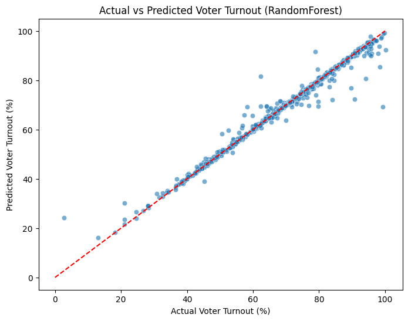
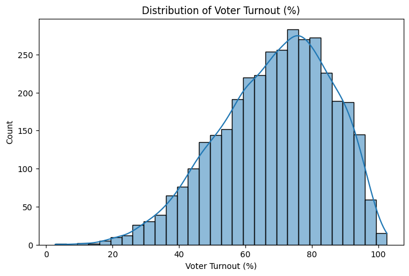
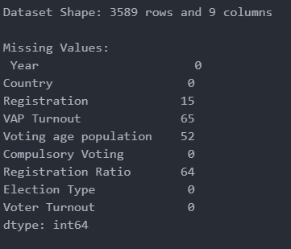
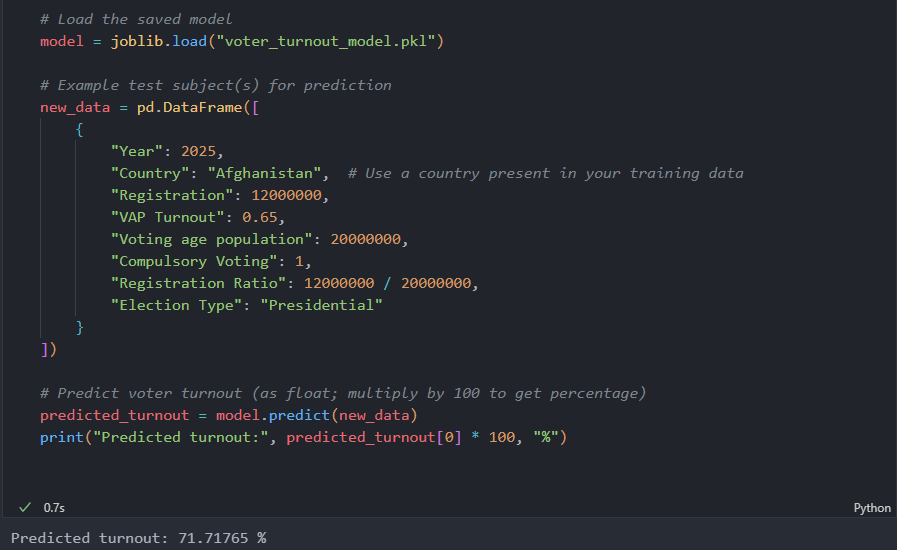
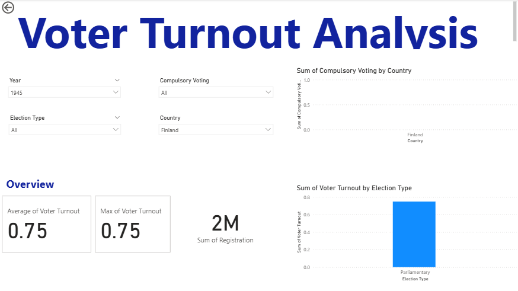
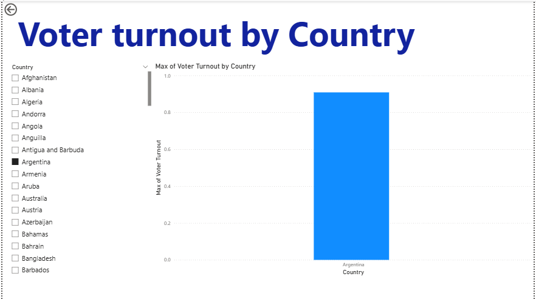
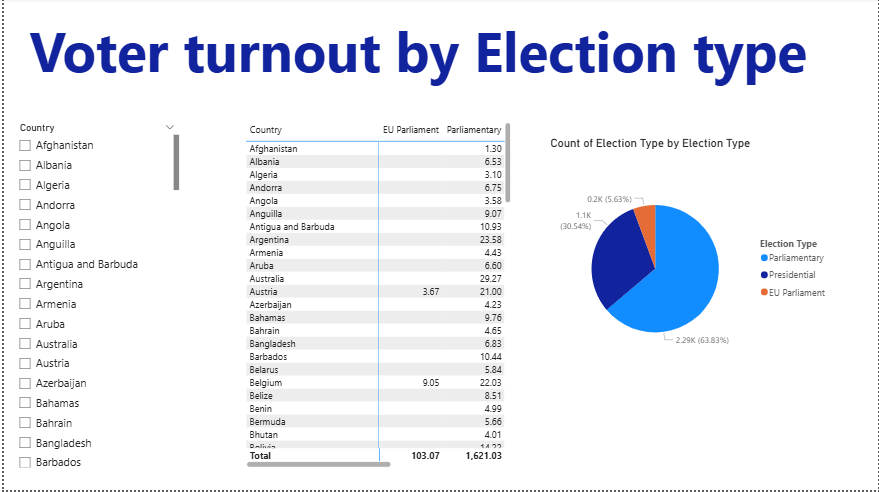
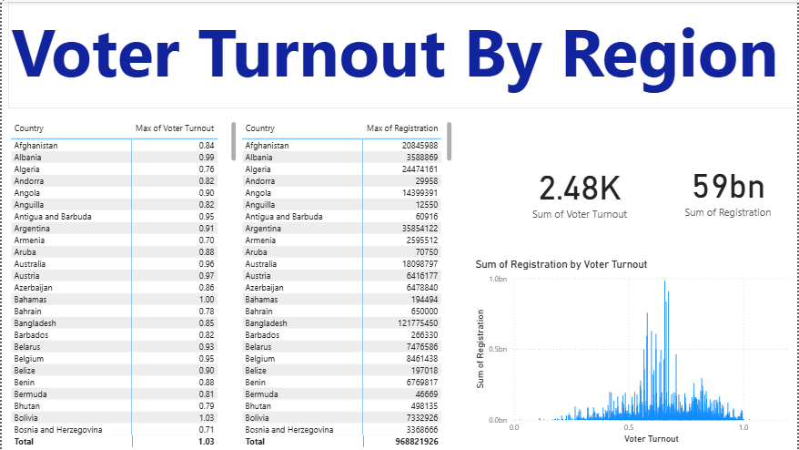
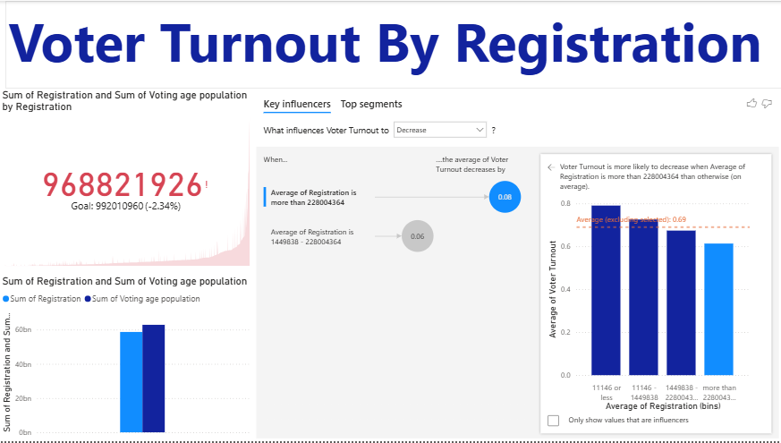
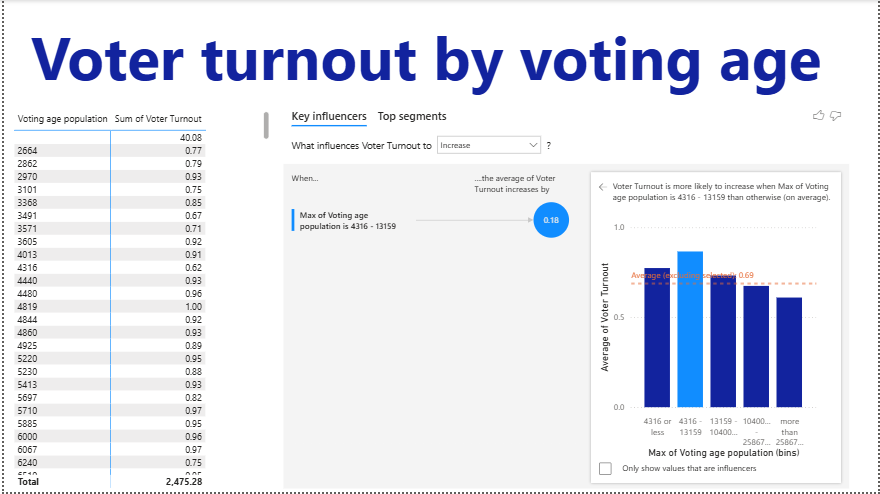

# **Big Data Analytics Project Description**

---

### **Student Information**

* **Full Name:** `Ingabire Nelly`
* **Student ID:** `27128`
* **Email Address:** `ingabirenelly72@gmail.com`
* **Class Group:** `Group A`
* **Faculty:** `Faculty of Science and Technology`
* **Date of Submission:** `7/30/2025`

---

### **Project Title**

**Predicting Voter Turnout Using Machine Learning Models**

---

# **Voter Turnout Prediction Using Machine Learning**

---

## **I. Sector Selection**

**Sector:**
☐ Agriculture ☐ Health ☐ Education ☐ Environment ☐ Energy ☑ Government ☐ Retail ☐ Finance
☐ Transportation ☐ Other: \_\_\_\_\_\_\_\_\_\_\_

**Share Link:**
[IDEA Voter Turnout Database](https://www.idea.int/data-tools/data/voter-turnout-database)

---

## **II. Problem Statement**

**Problem Statement:**
Can we predict **voter turnout percentage** for upcoming elections based on historical turnout data, registration numbers, voting age population, compulsory voting policies, election types, and country-specific differences?
This prediction can help **governments and electoral bodies** plan resources, improve voter mobilization strategies, and monitor democratic participation trends.

---

## **III. Dataset Identification**

* **Dataset Title:** IDEA Export Voter Turnout Database (Region-level)
* **Source Link:** [https://www.idea.int/data-tools/data/voter-turnout-database](https://www.idea.int/data-tools/data/voter-turnout-database)
* **Number of Rows and Columns:** Approx. 3,000 rows and 30+ columns (varies by sheet and filters applied)
* **Data Structure:** ☑ Structured (Excel file)
* **Data Status:** ☐ Clean ☑ Requires Preprocessing

*(Preprocessing includes cleaning numeric values, handling missing data, adding country and registration ratio features, and encoding categorical variables.)*

---

## **1. Overview**

This project predicts **voter turnout percentage** using historical election data.
Three machine learning models were trained and compared, with **hyperparameter tuning** applied for better accuracy:

* **Random Forest Regressor (tuned)**
* **Gradient Boosting Regressor (tuned)**
* **Linear Regression (baseline)**

The best tuned model (Random Forest) achieved **R² = 0.82** and an average error of **≈5 percentage points** after enhancements.

---

## **2. Dataset**

**Source:** IDEA Voter Turnout Database (Region-level)

### **Features Used**

* **Year** – Election year
* **Country** – Categorical feature to capture regional differences
* **Registration** – Number of registered voters
* **VAP Turnout** – Turnout rate of voting-age population
* **Voting Age Population** – Total eligible voters
* **Compulsory Voting** – Binary (Yes = 1, No = 0)
* **Registration Ratio** – New feature: `Registration / Voting Age Population`
* **Election Type** – Presidential / Parliamentary / etc.

### **Target Variable**

* **Voter Turnout (%):** Percentage of registered voters who voted

---

## **3. Data Cleaning**

* Removed commas and converted percentages to decimals
* Converted compulsory voting to binary
* Added **Country** and **Registration Ratio** as new features
* Extracted year from date
* Dropped rows missing voter turnout

**Output:** Cleaned dataset saved as:

```
cleaned_voter_turnout_with_country.csv
```

---

## **4. Exploratory Data Analysis**

### **Distribution of Voter Turnout**

*(Insert screenshot of histogram plot)*

**Key Insights**

* Turnout values cluster between **40%–80%**
* Countries with **compulsory voting** generally have higher turnout
* Presidential elections usually show higher turnout than parliamentary elections

---

## **5. Methodology**

1. **Preprocessing**

   * Numeric: Median imputation
   * Categorical: One-hot encoding for Country and Election Type

2. **Feature Engineering**

   * Added **Registration Ratio** for deeper turnout analysis

3. **Model Training & Tuning**

   * Train-test split: 80/20
   * Hyperparameter tuning using **GridSearchCV** for:

     * Random Forest (estimators, depth, min samples)
     * Gradient Boosting (estimators, learning rate, depth)
   * Linear Regression kept as baseline

4. **Evaluation Metrics**

   * **MAE (Mean Absolute Error)**
   * **RMSE (Root Mean Squared Error)**
   * **R² (Coefficient of Determination)**

---

## **6. Results**

### **Model Comparison (Tuned)**

## Model Performance Metrics


| Model                       | R-squared (R2) | Mean Absolute Error (MAE) | Mean Squared Error (MSE) |
| :-------------------------- | :------------- | :------------------------ | :----------------------- |
| Random Forest Regressor     | 0.9771         | 0.0095                    | 0.0006                   |
| Gradient Boosting Regressor | 0.9779         | 0.0127                    | 0.0006                   |
| Linear Regression           | 0.5630         | 0.0820                    | 0.0123                   |

---

**Best Model:** Random Forest (tuned) – highest R², lowest errors

---

## **7. Visualizations**

### **Actual vs Predicted (Random Forest)**




### **Residuals Distribution**


### **Feature Importance (Random Forest)**




### **Data structure**



---

## **8. Testing the model**


## **9. Applications**

* **Electoral Commissions:** Plan polling logistics and security
* **Political Parties:** Target campaigns to low-turnout regions
* **NGOs & Researchers:** Analyze participation trends and policy effects
* **Media:** Forecast turnout ahead of elections

---

## **10. Conclusion**

The tuned Random Forest model provides **robust predictions** of voter turnout with **82% explanatory power**.
Incorporating **country-level data and registration ratio** improved accuracy and provided deeper insights into turnout patterns.

---

## **11. PowerBI**

### **Vote turnout analysis**


### **Vote turnout analysis by country**


### **Vote turnout analysis by election type**


### **Vote turnout analysis by region**


### **Vote turnout analysis by registation**


### **Vote turnout analysis by voting age**



---

## **12. Files**

* `cleaned_voter_turnout_with_country.csv` – Training & evaluation script 
* `voter_turnout_best_model.pkl` – Best tuned model (Random Forest)
* `cleaned_voter_turnout.py` – Enhanced cleaned dataset
* `README.md` – Project documentation
* `idea_export_voter_turnout_database_region` – Raw data

---

## **12. Folders**

* `data` – Contains all data and code
* `report` – contains all report related files
* `images` – contains all screenshoots in data ptocessing
* `powerbi` – contains all slides from powerBI


---


## **13. Presentation**
[Power Point presentation](https://www.canva.com/design/DAGu9URNRb8/DsePRP_ayozpL-q9zve0xg/edit?utm_content=DAGu9URNRb8&utm_campaign=designshare&utm_medium=link2&utm_source=sharebutton)

---
## **14. References**

* [IDEA Voter Turnout Database](https://www.idea.int/data-tools/data/voter-turnout-database)
* [Scikit-learn Documentation](https://scikit-learn.org)

